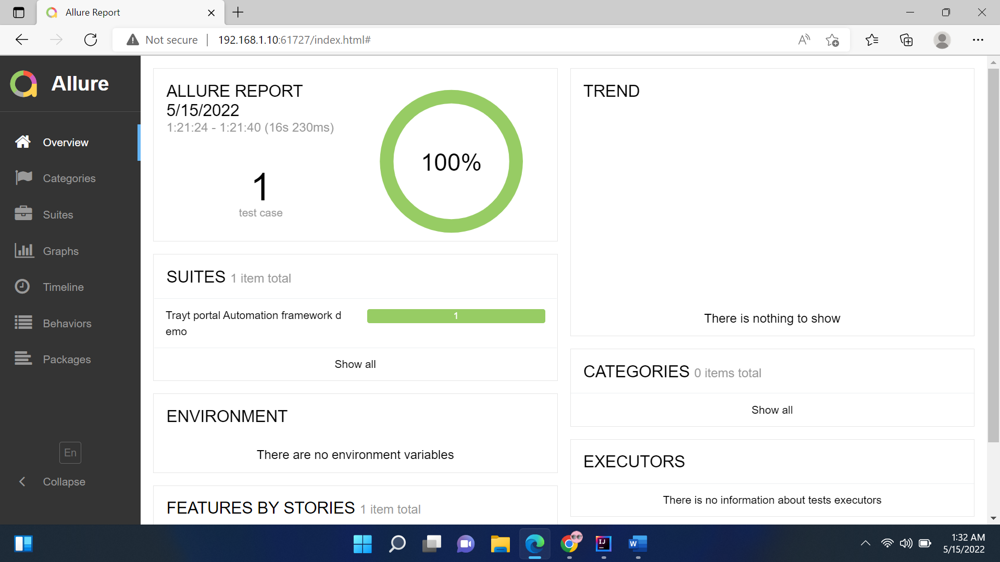
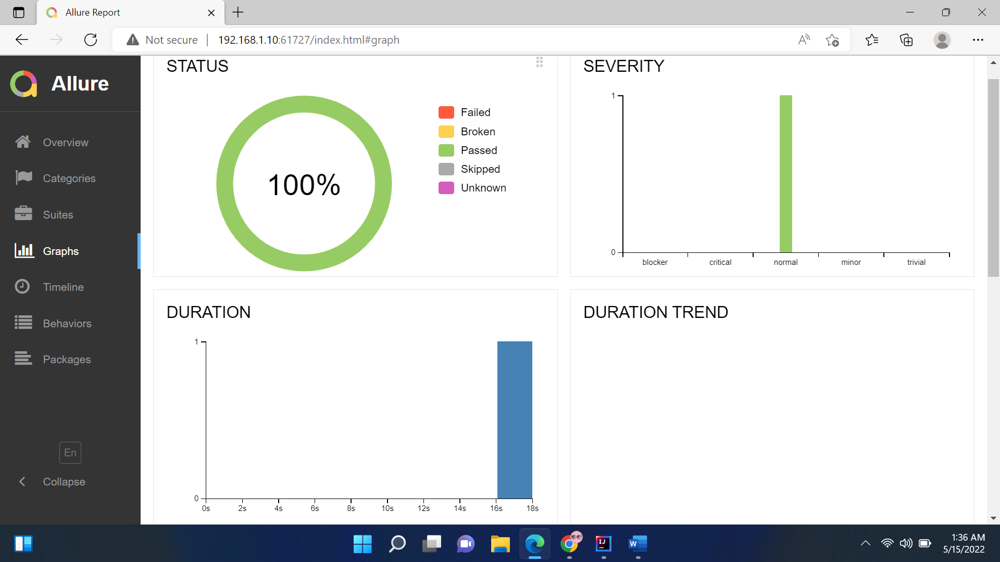

# Trayt Portal Test Automation Framework
This  repository contains code for Trayt portal test automation
## Tech Stack
* Spring Boot
* Cucumber
* Selenium
* Maven
* Allure Report
## Framework features
* Execute scenarios and features in groups using Cucumber tags
* Execute test in different browsers(Chrome, Firefox, Edge)
* Take screenshots for failed steps in scenario.
* Generate detailed execution report with trends and screenshots.
## Getting Started
1) ### Softwares to install
   Apart from Java8 and Intellij/Eclipse IDE, We need below tools to be installed to execute tests.
   * [Maven build Tool](https://maven.apache.org/install.html)
   * [Allure Reporting tool](https://docs.qameta.io/allure/#_installing_a_commandline)
2) ### How to add test to framework
   To include tests to framework follow below process.
   1) Write test cases in feature file by using gherkin language and put it in **features folder**. 
      **Example:** Sample Feature file path [TraytPortalDemo.feature](src/test/resources/features/TraytPortalDemo.feature)
   2) Generate Step definitions for the feature file by using any one of the below method.
      * [Intellij Cucumber java plugin](https://www.jetbrains.com/help/idea/creating-step-definition.html#navigate-steps-definitions) (Most preferred and easy way)
      * Right click on Feature file and add "spring.profiles.active=dev" as Environment variable in runconfiguration 
        and run the feature file. Cucumber will generate sample Step definitions snippet in console, copy the sample snippet 
        and create a class in **stepdefinitions folder** and paste it in that class. 
        **Example:** Sample Step definition class [LoginDemoStepDefs.java](src/test/java/health/trayt/automation/stepdefinitions/LoginDemoStepDefs.java)
   3) All the elements we need to interact in our scenarios should be inspected and should be added to the page object class created in **pages folder**. 
      **Example:** Sample page object class [HomePage.java](src/test/java/health/trayt/automation/pages/HomePage.java)
   4) All the common data like urls and credentials required to execute test cases will go in [**application.yml**](src/test/resources/application.yml) file.
3) ### How to run Automation Framework
   * By using maven command.(Most preferred and suggested way) 
     **Example:** 
     `mvn clean test -DSpring.profiles.active=dev -Dcucumber.filter.tags=@ReferralFlows -Dbrowser=chrome`
      Possible values for below properties 
     **spring.profiles.active:** dev or qa or stage or prod
      **browser:** chrome or edge or firefox
      **cucumber.filter.tags:** all the tags we want run 
4) ### Generate Execution Report
   * After execution is completed in command prompt navigate to **target folder** and run the below command. 
     `allure serve` 
    Sample report looks like below image: 
    **Overview page:** 
    
    **Graph and trends:** 
    